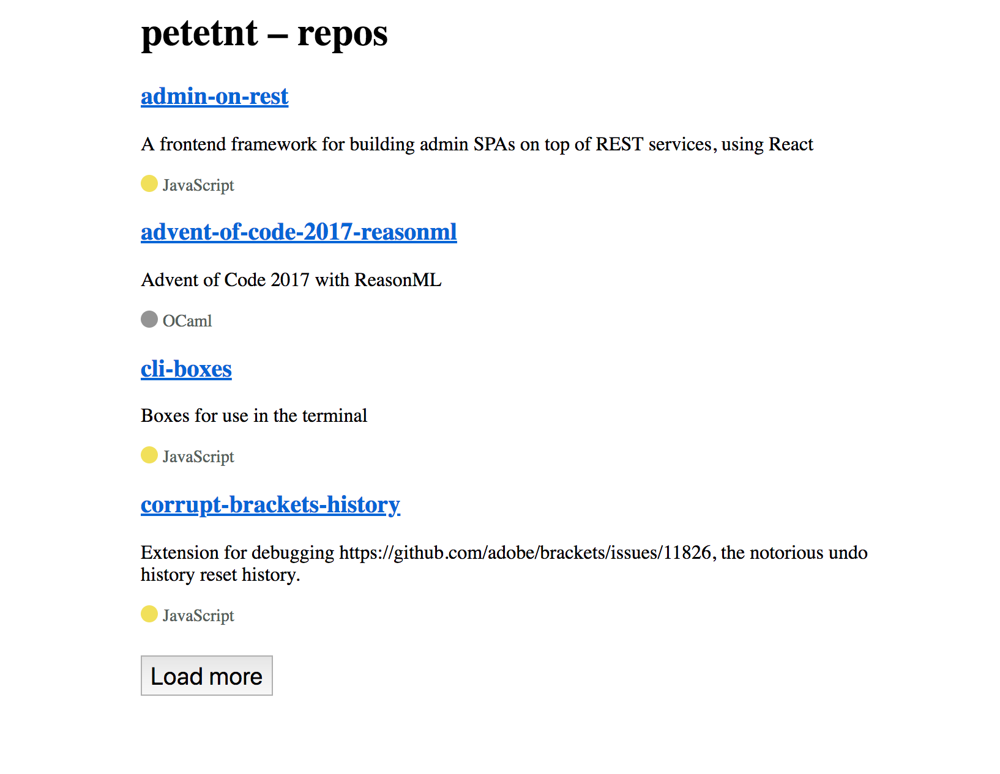

# Code challenge - frontend

This code challenge tests your frontend skills.

## Scenario

We really really urgently need a sweet list of your public GitHub Repos, but someone left it half
finished! Oh no! Your task is to:

1.  Read this `README`
2.  Install deps with `yarn` or `npm install`. We usually use `yarn`.
3.  Create a MVP of the repo list (hint: check `// @TODO:s`)
4.  Make sure that the tests pass (`yarn test`)
5.  (If you are applying for a job) Submit your work to us (See [../../README.md](../../README.md)) and we will discuss it in the next interview!

### MVP

* Can show a initial list of the repositories the user has, including:
  * Link to the repo
  * Name of the repo
  * Description
  * Language
* Can paginate through all the repositories by pressing a `Load more` button
* Tests pass

### The layout

Should look something like this:

There's also a [Figma layout for it](https://www.figma.com/file/QGzYD0dU67oFpzNE8KDZrwIC/motley-code-challenge-frontend).

### Hints

* This project was bootstrapped with [Create React App](https://github.com/facebookincubator/create-react-app), so if you are familiar
  with CRA, you are in luck! Otherwise you might want to [get familiar with it first](<(https://github.com/facebookincubator/create-react-app/blob/master/packages/react-scripts/template/README.md)>).

* The tests are done with [Jest](https://facebook.github.io/jest/) and [Enzyme](http://airbnb.io/enzyme/), but you can use plain [React TestUtilities](https://reactjs.org/docs/test-utils.html) or something like [`react-testing-library`](https://github.com/kentcdodds/react-testing-library)
  too.

* You'll need [a GitHub account to get the API token](https://developer.github.com/v3/auth/#basic-authentication). See [settings/tokens](https://github.com/settings/tokens).

* The project uses [`styled-components`](https://www.styled-components.com/) for the CSS(-in-js), because most of our projects have also used it. Same with [`redux`](https://github.com/reduxjs/redux) and [`redux-thunk`](https://github.com/reduxjs/redux-thunk),
  but you can get rid of both or replace them with some other state management system you want to.

* You will find that the project is _really_ incomplete, as in it might actually be _completely_ broken, but that's expected. Debugging is part of the job and ask for help if you get stuck.

* This project uses [our styleguide](https://github.com/motleyagency/eslint-config-motley), which might not fit 100% to your current coding style. Not to worry, we are quite flexible with it and formatting is handled by
  Prettier in _pre-commit_ phase.

### Bonus points

We use lots of GraphQL these days, mainly with [Apollo](https://www.apollographql.com/client/). Document how you would do the app if it was using GraphQL. If you are really feeling wild, implement it!

# Generic CRA README

Below you will find some information on how to perform common tasks. 
You can find the most recent version of the full guide guide [here](https://github.com/facebookincubator/create-react-app/blob/master/packages/react-scripts/template/README.md).

## Available Scripts

In the project directory, you can run:

### `npm start`

Runs the app in the development mode. 
Open [http://localhost:3000](http://localhost:3000) to view it in the browser.

The page will reload if you make edits. 
You will also see any lint errors in the console.

### `npm test`

Launches the test runner in the interactive watch mode. 
See the section about [running tests](#running-tests) for more information.

### `npm run build`

Builds the app for production to the `build` folder. 
It correctly bundles React in production mode and optimizes the build for the best performance.

The build is minified and the filenames include the hashes. 
Your app is ready to be deployed!

See the section about [deployment](#deployment) for more information.

### `npm run eject`

**Note: this is a one-way operation. Once you `eject`, you can’t go back!**

If you aren’t satisfied with the build tool and configuration choices, you can `eject` at any time. This command will remove the single build dependency from your project.

Instead, it will copy all the configuration files and the transitive dependencies (Webpack, Babel, ESLint, etc) right into your project so you have full control over them. All of the commands except `eject` will still work, but they will point to the copied scripts so you can tweak them. At this point you’re on your own.

You don’t have to ever use `eject`. The curated feature set is suitable for small and middle deployments, and you shouldn’t feel obligated to use this feature. However we understand that this tool wouldn’t be useful if you couldn’t customize it when you are ready for it.
